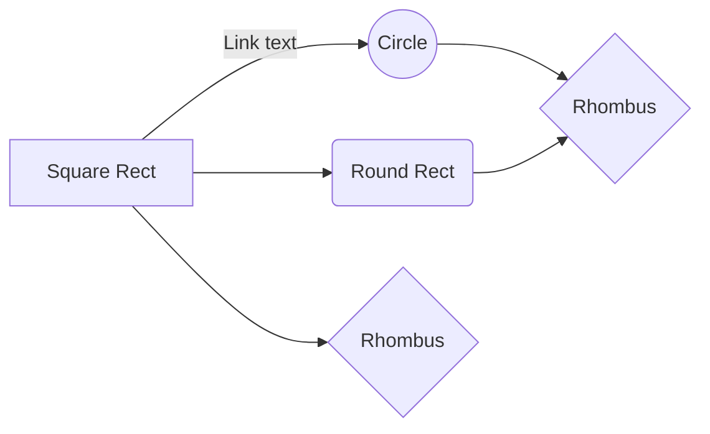

# Person-Tracking-Tello-Drone
Python script for using a Tello drone to track and follow a person

```mermaid
graph LR
A[Square Rect] -- Link text --> B((Circle))
A --> C(Round Rect)
B --> D{Rhombus}
C --> D
A --> E{Rhombus}
```
